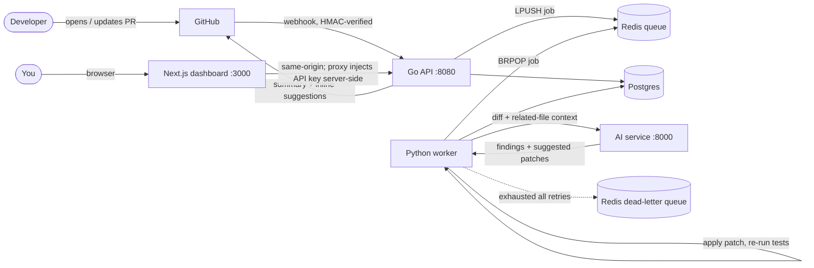

# AI Code Review & DevSecOps Agent Platform

Automatically reviews GitHub pull requests end to end: on every PR it runs the
repo's tests, static analysis (Semgrep) and a dependency audit (`npm audit`),
then an LLM agent writes findings — and **verifies each AI-suggested fix by
applying the patch and re-running the test suite** before posting review
comments back to the PR.

[](https://github.com/goldenk23/AI-Code-Review-and-DevSecOps-Agent-Platform/actions/workflows/ci.yml)

## Architecture

Four independent services behind an async job queue. The API accepts webhooks
fast and hands the slow work (clone → test → scan → LLM) to a worker over
Redis, so GitHub never waits on a minutes-long review.



## Why it's interesting

- **Verified fixes, not just suggestions.** The worker applies each
  AI-proposed patch into a throwaway copy and re-runs the tests; only findings
  whose patch actually passes are marked `verified_by_test`. (`verify_patch` in
  `apps/worker/worker.py`.)
- **Async by design.** Webhook is HMAC-verified and acknowledged in
  milliseconds; the review runs off a Redis list (`LPUSH` from the API, `BRPOP`
  from the worker). Workers scale horizontally with no code change.
- **Resilience.** Failed jobs retry with exponential backoff; jobs that exhaust
  all retries land in a Redis **dead-letter queue** (`ai_review_jobs_dead`) and
  are viewable at `/dead-jobs` instead of vanishing.
- **Observability.** The worker exports Prometheus metrics on `:9090`
  (`analysis_job_duration_seconds`, `ai_review_latency_seconds`,
  `patch_verify_seconds`, token usage).
- **Security touches.** GitHub webhook HMAC verification, OAuth tokens encrypted
  at rest (AES-256-GCM, `apps/api/internal/auth/crypto.go`), a shared API key on
  the `/api` routes (injected server-side by the dashboard proxy), and a
  single-origin CORS policy.

## Tech stack

Go (chi) · Python (FastAPI + a plain worker) · Next.js 16 (App Router, TS) ·
Postgres (pgx) · Redis · Semgrep · Prometheus · Docker Compose · GitHub Actions.

## Quickstart

Prereqs: Docker, Go, Python, Node. Create the env files first:

```
cp apps/api/.env.example        apps/api/.env
cp apps/worker/.env.example     apps/worker/.env
cp apps/ai-service/.env.example apps/ai-service/.env    # add your OPENCODE_GO_API_KEY
```

Then either run the dev loop (hot reload; Docker runs only Postgres + Redis):

```
.\start.ps1
```

or run the whole stack in containers:

```
docker compose up --build
# web http://localhost:3000 · api http://localhost:8080/health · ai http://localhost:8000/docs
```

See `AGENTS.md` and `docs/` for the deeper walkthrough, and `docs/README.md`
for scaling the worker.

## Security notes

- `/api/*` requires an `X-API-Key`. The Next dashboard injects it server-side
  (`apps/web/src/proxy.ts`), so the browser never holds the key and a direct
  call to the API host is rejected. If `API_KEY` is unset the API logs a
  warning and allows requests (local-dev convenience) — set it everywhere else,
  matching the web app's `API_KEY`.
- GitHub webhooks are rejected unless the `X-Hub-Signature-256` HMAC matches
  `GITHUB_WEBHOOK_SECRET`.
- OAuth tokens are encrypted with `TOKEN_ENCRYPTION_KEY` before hitting the DB.
- All real secrets live in gitignored `.env` files; only `.env.example`
  templates are committed.

## Tests

```
cd apps/api        ; go test ./...
cd apps/worker     ; python -m pytest -v
cd apps/ai-service ; python -m pytest -v
cd apps/web        ; npm run lint      # typecheck runs via `next build`
```

CI (`.github/workflows/ci.yml`) runs all four on every push/PR.

## Benchmarks

A reproducible harness lives in `benchmark.ps1`. It is **not** run in CI and the
numbers depend on your hardware and the repo under test, so run it locally and
paste your results here.

```
go install github.com/rakyll/hey@latest   # one-time: the load generator
.\start.ps1                                # terminal 1: bring up the stack
python send_webhook.py                     # terminal 2: seed a few runs
.\benchmark.ps1                            # all groups
.\benchmark.ps1 -Only api                  # or one: api | e2e | ai | scale | patch
```

What each number means and how it's measured:

| Metric | How it's measured |
|---|---|
| API throughput (req/s) | `hey -n 5000 -c 50` against `/api/analyses` |
| API p99 latency | same `hey` run |
| Webhook accept time | `curl %{time_total}` on a valid-HMAC webhook (real enqueue) |
| End-to-end job latency | `completed_at − created_at` from Postgres, per job |
| Worker processing time | `completed_at − started_at`, per job |
| AI review latency | Prometheus `ai_review_latency_seconds` |
| Worker throughput (1 vs 3 workers) | active-window jobs/min |
| Scaling speedup | 3-worker ÷ 1-worker throughput |
| Patch verification time | Prometheus `patch_verify_seconds` |

> Reproducibility note: always benchmark against the **same repo** and record
> its size. The `api` group needs only Postgres + Redis + the API; the `e2e`,
> `ai`, `scale`, and `patch` groups run the full pipeline and therefore require
> `OPENCODE_GO_API_KEY` (the LLM key) in `apps/ai-service/.env`.

## Repository layout

```
apps/api          Go API — webhooks, OAuth, REST for the dashboard, GitHub comments
apps/worker       Python worker — clone, test, scan, call AI, verify patches, persist
apps/ai-service   FastAPI /review endpoint wrapping the LLM agent
apps/web          Next.js 16 dashboard
docs/             architecture, flows, database, development notes
docker-compose.yml, start.ps1, benchmark.ps1
```
