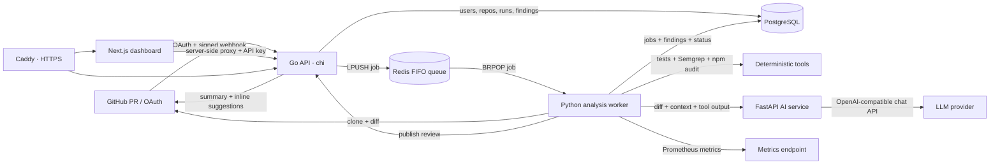
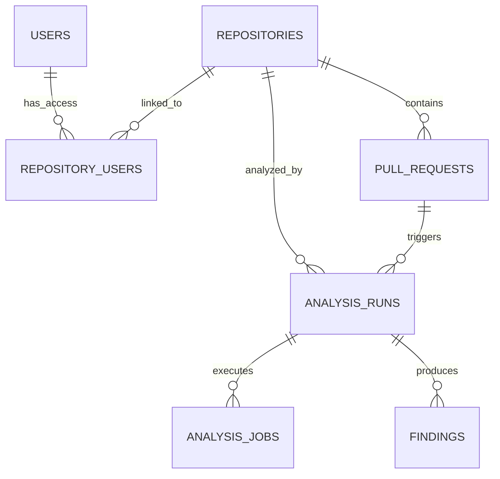

# AI Code Review & DevSecOps Agent Platform

> An event-driven platform that reviews GitHub pull requests with deterministic security tools and an evidence-focused LLM, verifies suggested fixes when tests are available, and publishes actionable feedback back to GitHub.

[](https://github.com/goldenk23/AI-Code-Review-and-DevSecOps-Agent-Platform/actions/workflows/ci.yml)


## Why this project is more than an LLM wrapper

A pull request is accepted through a signed GitHub webhook, persisted idempotently, queued in Redis, and processed outside the HTTP request path. The worker combines repository tests, Semgrep, npm audit, related-file retrieval, and an OpenAI-compatible model. Findings retain evidence, confidence, severity, category, and verification state; suggested patches can be applied in a disposable copy and tested before being surfaced.

The project demonstrates production-oriented backend concerns across service boundaries:

- **Event-driven processing:** webhook ingestion is decoupled from expensive analysis through a FIFO Redis queue.
- **Layered analysis:** deterministic scanners complement probabilistic AI review instead of being replaced by it.
- **Evidence and verification:** AI findings require supporting evidence and remain explicitly unverified unless a test confirms the patch.
- **Failure recovery:** selective retries, exponential backoff, stale-run cleanup, and a dead-letter queue preserve failure visibility.
- **Security by design:** signed webhooks, OAuth state validation, encrypted tokens, signed sessions, allowlisted users, service authentication, and secret scrubbing.
- **Horizontal scaling:** independent workers consume the same queue; the included benchmark compares one and three workers.
- **Operational visibility:** step-level job records, structured API logs, worker health, and Prometheus metrics make the pipeline observable.
- **Reproducible delivery:** Docker Compose, ordered SQL migrations, production HTTPS through Caddy, and four independent CI jobs.

## Architecture

<details>
<summary><strong>Click to expand — full architecture diagram</strong></summary>
<br>



</details>
## End-to-end review lifecycle

1. A user signs in with GitHub. The API validates a short-lived OAuth state value, syncs accessible repositories, encrypts the OAuth token with AES-256-GCM, and creates a signed `HttpOnly` session.
2. From the dashboard, the user connects an `owner/repo`. The API installs a pull-request webhook through GitHub and records the repository-user relationship.
3. GitHub sends a `pull_request` event for `opened`, `reopened`, or `synchronize`. The API validates `X-Hub-Signature-256` before parsing the payload.
4. PostgreSQL receives the repository, pull request, and analysis run. A unique `(repository, pull request, commit SHA)` constraint makes webhook delivery idempotent.
5. The API pushes a compact job to `ai_review_jobs`; a worker blocks on the other end of the Redis list, preserving FIFO behavior.
6. The worker creates a temporary workspace, clones anonymously when possible, falls back to a repository-scoped OAuth token for private repositories, and checks out the PR branch.
7. The worker detects and optionally runs `npm test` or `pytest`, then executes Semgrep and npm audit. Each step is persisted independently with status, exit code, timestamps, and logs.
8. The worker computes the PR diff, discovers related files, bounds the context size, and sends the diff, context, and tool output to the AI service.
9. The AI service asks for structured, evidence-backed findings and defensively parses plain, fenced, or embedded JSON. Transient provider failures receive bounded retries.
10. Static findings are marked `verified_by_static_analysis`; AI findings begin as `unverified`. If repository tests are enabled and a patch is present, the worker applies it in a disposable copy and records `verified_by_test` or `failed_verification`.
11. Findings and run state are committed to PostgreSQL. The API publishes inline GitHub suggestions where possible and creates or updates a tagged summary comment.
12. The dashboard polls recent analyses and exposes run progress, findings, security insights, repository filters, worker health, and terminal failures in the dead-letter queue.

## Core capabilities

| Area | What is implemented |
| --- | --- |
| GitHub integration | OAuth login, repository synchronization, automatic webhook installation/removal, private-repository token fallback, PR summary comments, and inline suggestions |
| Review pipeline | PR diff extraction, related-file context, repository test detection, Semgrep, npm audit, LLM review, structured findings, and patch verification |
| Dashboard | Live run polling, repository filtering, job progress, severity/category filters, confidence/evidence display, verification badges, insights, repository management, and DLQ inspection |
| Reliability | Idempotent webhook handling, FIFO queueing, bounded retries, exponential backoff, stale-run reaping, terminal failure persistence, and Redis dead-letter queue |
| Security | HMAC webhook verification, OAuth CSRF state, AES-GCM token encryption, signed sessions, user allowlist, shared service API key, restricted CORS, and production config validation |
| Operations | Health endpoints, Prometheus worker metrics, Docker health checks, ordered migrations, horizontal worker scaling, benchmark automation, and CI across all four applications |
| Deployment | Local PowerShell launcher, full-stack Docker Compose, production profile, loopback-only service bindings, Caddy reverse proxy, automatic TLS, and security headers |

## Verification model

The platform deliberately distinguishes the source and strength of a finding:

| Status | Meaning |
| --- | --- |
| `verified_by_static_analysis` | A deterministic Semgrep rule or npm audit record produced the finding |
| `verified_by_test` | An AI-suggested patch applied cleanly and the detected repository tests passed |
| `failed_verification` | The patch did not apply, timed out, or caused tests to fail |
| `unverified` | The LLM produced an evidence-backed finding, but no deterministic verification was available |

This avoids presenting model output as certainty and gives reviewers a practical signal for prioritization.

## Measured performance

The repository includes `benchmark.ps1`, which exercises the real API, signed webhook path, queue, worker pipeline, AI latency metrics, patch verification metrics, and one-vs-three-worker scaling.

Latest local run on **July 24, 2026**: Windows host, Dockerized PostgreSQL/Redis, one API, one AI service. These are development measurements—not production SLAs.

| Measurement | Result | Method |
| --- | ---: | --- |
| API throughput | **1,052.68 requests/s** | `hey -n 5000 -c 50` against `/api/analyses` |
| API p99 latency | **145.5 ms** | Same 5,000-request run |
| Signed webhook acceptance | **26.9 ms average** | Valid HMAC, database writes, and real Redis enqueue; 5 samples |
| Worker processing time | **11.8 s average** | Started-to-completed time across 20 jobs |
| One-worker throughput | **4.33 jobs/min** | Active processing window |
| Three-worker scaling | **3.13× speedup** | 30-job, one-vs-three-worker comparison |
| Average E2E latency after scale-out | **271.9 s → 82.7 s** | Queue-to-completion, one worker vs. three |
| AI review latency | **5.47 s average** | 25 model calls measured through Prometheus |
| Reliability sample | **20/20 completed, 0 failed** | Single-worker end-to-end benchmark |

Reproduce the measurements after starting the platform:

```powershell
go install github.com/rakyll/hey@latest
.\benchmark.ps1
# Or target one area:
.\benchmark.ps1 -Only api
.\benchmark.ps1 -Only e2e
.\benchmark.ps1 -Only scale
.\benchmark.ps1 -Only ai
.\benchmark.ps1 -Only patch
```

## Technology stack

| Layer | Technologies |
| --- | --- |
| Web | Next.js 16.2, React 19, TypeScript, TanStack React Query, Tailwind CSS 4 |
| API | Go 1.26, chi v5, pgx v5, go-redis, Zap |
| Worker | Python 3.11, psycopg2, redis-py, httpx, Prometheus client, Semgrep |
| AI service | FastAPI, Pydantic, httpx, OpenAI-compatible `/chat/completions` provider |
| Data and queue | PostgreSQL 16, Redis 7 |
| Infrastructure | Docker Compose, Caddy 2, GitHub Actions |
| Analysis tools | Git, repository tests, Semgrep, npm audit, related-file retrieval |

## Quick start

### Prerequisites

For the fastest full-stack setup, install:

- Docker Desktop with Docker Compose
- Git
- A GitHub OAuth App
- An API key for the configured OpenAI-compatible LLM provider

For the native Windows development loop, also install Go 1.26+, Node.js 22+, Python 3.11+, and npm.

### 1. Clone the repository

```powershell
git clone https://github.com/goldenk23/AI-Code-Review-and-DevSecOps-Agent-Platform.git
Set-Location AI-Code-Review-and-DevSecOps-Agent-Platform
```

### 2. Create local configuration

```powershell
Copy-Item apps/api/.env.example apps/api/.env
Copy-Item apps/worker/.env.example apps/worker/.env
Copy-Item apps/ai-service/.env.example apps/ai-service/.env
```

Generate strong values with the Python standard library:

```powershell
python -c "import secrets; print(secrets.token_hex(32))"
```

Update `apps/api/.env`:

```dotenv
GITHUB_CLIENT_ID=your-github-oauth-client-id
GITHUB_CLIENT_SECRET=your-github-oauth-client-secret
GITHUB_WEBHOOK_SECRET=a-random-secret
TOKEN_ENCRYPTION_KEY=a-64-character-hex-value
API_KEY=a-random-service-key-at-least-32-characters
SESSION_SECRET=a-different-random-key-at-least-32-characters
ALLOWED_GITHUB_USERS=your-github-username
GITHUB_CALLBACK_URL=http://localhost:3000/auth/github/callback
```

Use the same `API_KEY` in `apps/worker/.env`. Then set the provider credential in `apps/ai-service/.env`:

```dotenv
OPENCODE_GO_API_KEY=your-provider-key
# Optional: override OPENCODE_GO_MODEL and OPENCODE_GO_BASE_URL
```

Create a GitHub OAuth App under **GitHub → Settings → Developer settings → OAuth Apps** with:

- Homepage URL: `http://localhost:3000`
- Authorization callback URL: `http://localhost:3000/auth/github/callback`

### 3. Start the platform

**Native Windows development loop**—infrastructure in Docker, applications as local processes:

```powershell
.\start.ps1
```

The launcher starts PostgreSQL and Redis, applies migrations in filename order, installs missing dependencies, launches all four applications, tails their logs, and cleans them up on `Ctrl+C`.

**Fully containerized demo**—all services in Docker:

```powershell
docker compose up --build
```

Do not run both modes simultaneously; they use the same ports.

| Service | URL |
| --- | --- |
| Dashboard | http://localhost:3000 |
| Go API health | http://localhost:8080/health |
| AI service docs | http://localhost:8000/docs |
| Worker metrics | http://localhost:9090/metrics in native mode |
| PostgreSQL | `localhost:5432` |
| Redis | `localhost:6379` |

### 4. Exercise the pipeline

For a local signed-webhook smoke test:

```powershell
python send_webhook.py
```

For a real GitHub repository, expose the API webhook endpoint over HTTPS, set:

```dotenv
WEBHOOK_PUBLIC_URL=https://your-domain.example/webhooks/github
```

Then sign in, open **Repositories**, connect an `owner/repo`, and create or update a pull request. Automatic webhook installation requires repository admin permission; otherwise add the webhook manually with the same `GITHUB_WEBHOOK_SECRET`.

> GitHub cannot deliver webhooks to `localhost`. Use the production profile or a trusted HTTPS tunnel for real webhook delivery during local development.

## Configuration reference

### API

| Variable | Purpose |
| --- | --- |
| `DATABASE_URL` | PostgreSQL connection string |
| `REDIS_ADDR` | Redis address used by the Go queue client |
| `GITHUB_CLIENT_ID`, `GITHUB_CLIENT_SECRET` | GitHub OAuth application credentials |
| `GITHUB_WEBHOOK_SECRET` | HMAC secret shared with GitHub webhooks |
| `TOKEN_ENCRYPTION_KEY` | 32-byte AES key encoded as 64 hexadecimal characters |
| `API_KEY` | Shared key protecting `/api` and `/internal` routes |
| `SESSION_SECRET` | HMAC key for signed dashboard sessions; must differ from `API_KEY` |
| `ALLOWED_GITHUB_USERS` | Comma-separated login allowlist; required outside development/test |
| `GITHUB_CALLBACK_URL` | Exact OAuth callback URL |
| `WEBHOOK_PUBLIC_URL` | Public HTTPS endpoint installed on connected repositories |
| `CORS_ALLOWED_ORIGIN` | Single allowed dashboard browser origin |
| `WORKER_METRICS_URL` | Worker Prometheus endpoint used for health/insights |

### Worker and AI service

| Variable | Purpose |
| --- | --- |
| `REDIS_URL`, `DATABASE_URL` | Worker queue and persistence connections |
| `AI_SERVICE_URL`, `API_BASE_URL` | Internal service addresses |
| `RUN_REPOSITORY_TESTS` | Enables execution of cloned repository tests; trusted repositories only |
| `WORKER_ID`, `METRICS_PORT` | Worker identity and per-process metrics port |
| `AI_REQUEST_TIMEOUT` | Worker timeout budget for the AI service |
| `OPENCODE_GO_API_KEY` | LLM provider credential |
| `OPENCODE_GO_MODEL`, `OPENCODE_GO_BASE_URL` | Optional OpenAI-compatible model/provider overrides |
| `OPENCODE_GO_MAX_TOKENS`, `OPENCODE_GO_TIMEOUT` | Model response and timeout limits |
| `OPENCODE_GO_ENABLE_THINKING` | Optional reasoning-mode toggle; disabled by default |

## API overview

The browser reaches the Go service through the Next.js server-side proxy, which strips caller-supplied service headers and injects the real API key.

| Method and route | Purpose | Protection |
| --- | --- | --- |
| `GET /health` | API liveness | Public |
| `GET /worker/health` | Worker metrics reachability | Public |
| `GET /auth/github` | Start GitHub OAuth | Public |
| `GET /auth/github/callback` | Validate state and establish session | OAuth state |
| `GET /auth/session`, `POST /auth/logout` | Session lifecycle | Signed cookie |
| `POST /webhooks/github` | Receive PR events | GitHub HMAC signature |
| `GET /api/analyses[?repo_id=]` | List recent runs | API key |
| `GET /api/analyses/{id}` | Run details | API key |
| `GET /api/analyses/{id}/jobs` | Per-step status | API key |
| `GET /api/analyses/{id}/findings` | Findings for a run | API key |
| `POST /api/analyses/{id}/post-comments` | Publish/update GitHub review | API key |
| `GET/POST/DELETE /api/repositories...` | List, connect, and disconnect repositories | API key + user session for mutations |
| `GET /api/findings` | Filter findings by severity/repository | API key |
| `GET /api/insights/...` | Summary, trends, vulnerable repositories, worker status | API key |
| `GET/PUT /api/settings` | Persist dashboard automation settings | API key |
| `GET /api/dead-jobs` | Inspect terminal queue failures | API key |
| `GET /internal/analyses/{id}/github-token` | Supply a repository token to a worker | API key |
| `POST /review` | Execute structured AI review | Internal AI service |

## Data model

Ordered, idempotent SQL migrations create the platform's core records:



- `users`: GitHub identity and encrypted OAuth token
- `repositories`: GitHub repository identity and installed webhook ID
- `repository_users`: many-to-many repository access mapping
- `pull_requests`: PR number, title, author, and current head SHA
- `analysis_runs`: queue/running/completed/failed lifecycle per commit
- `analysis_jobs`: test, Semgrep, and npm-audit execution details
- `findings`: location, severity, category, evidence, confidence, verification status, and optional patch
- `settings`: singleton dashboard configuration record

## Security design

| Control | Threat addressed |
| --- | --- |
| Constant-time HMAC-SHA256 webhook verification | Forged or tampered GitHub events |
| Random, expiring OAuth state cookie | Login CSRF |
| AES-256-GCM OAuth token encryption | Plaintext credential exposure in PostgreSQL |
| HMAC-signed, expiring `HttpOnly`, `SameSite=Lax` session | Session tampering and script access |
| `Secure` cookies in production | Session disclosure over plaintext transport |
| GitHub username allowlist | Unauthorized dashboard access |
| Shared API key with constant-time comparison | Unauthorized service/API calls |
| Server-side Next.js key injection | Exposing the service key to browser JavaScript |
| Single-origin CORS policy | Untrusted browser origins |
| Credential-free anonymous clone first; transient auth header fallback | Tokens leaking into Git URLs/process arguments |
| Secret stripping before repository subprocesses | Reviewed code reading platform credentials |
| Fail-fast production validation | Placeholder, short, reused, non-HTTPS, or malformed configuration |
| Loopback-only Compose bindings and Caddy edge gateway | Direct internet exposure of internal services |
| HSTS, content-type, and referrer headers | Common transport/browser hardening gaps |

> **Trust boundary:** repository tests execute code from the reviewed branch. They are enabled by default only for development/test and should remain disabled in a public or shared deployment unless every repository and contributor is trusted. A temporary directory is cleanup isolation, not a security sandbox.

## Reliability and scaling choices

- **Idempotency:** duplicate webhook deliveries for the same repository, PR, and commit SHA do not create duplicate runs.
- **Fast ingestion:** the webhook handler performs validation/persistence/enqueueing and leaves clone/scan/AI work to workers.
- **FIFO contract:** Go uses `LPUSH`; Python uses `BRPOP`. Multiple workers can consume the queue concurrently.
- **Selective retries:** transient failures retry up to three total attempts; deterministic timeouts and already-retried AI 5xx responses are dead-lettered immediately.
- **Failure visibility:** run errors are persisted, terminal payloads enter `ai_review_jobs_dead`, and the dashboard exposes the latest dead jobs without deleting them.
- **Crash cleanup:** worker startup marks old `running` rows failed when a prior process exited after dequeueing a job.
- **Best-effort delivery:** GitHub comment failure does not discard findings already stored in PostgreSQL.
- **Scale-out:** run more worker processes/containers against the same Redis and PostgreSQL services; assign unique metrics ports when running locally.

```powershell
# Container scale-out
docker compose up -d --scale worker=3
```

## Observability

Each worker exposes Prometheus-format metrics:

- `analysis_job_duration_seconds{job_type}`
- `analysis_jobs_total{status}`
- `ai_review_latency_seconds`
- `ai_token_usage_total`
- `patch_verify_seconds`

The dashboard/API also expose run timestamps, job status, exit codes, persisted logs, worker reachability, finding trends, and vulnerable-repository summaries. The repository intentionally does not bundle a Prometheus server or Grafana; the endpoint is ready for an external scraper.

## Project structure

```text
.
├── .github/workflows/ci.yml        # Four-service CI pipeline
├── apps/
│   ├── api/                        # Go/chi API, auth, GitHub integration, migrations
│   │   ├── internal/
│   │   │   ├── api/                # Analyses, findings, repositories, insights, settings
│   │   │   ├── auth/               # OAuth, encrypted tokens, signed sessions
│   │   │   ├── database/           # PostgreSQL pool
│   │   │   ├── github/             # GitHub REST client and comments
│   │   │   ├── queue/              # Redis queue contract
│   │   │   └── webhook/            # Signature validation and event ingestion
│   │   └── migrations/             # Forward-only idempotent SQL migrations
│   ├── worker/                     # Queue consumer and analysis orchestration
│   │   ├── worker.py               # Clone, scan, AI, verification, retries, metrics
│   │   ├── retrieval.py            # Related-file context retrieval
│   │   └── custom_semgrep_rule.yml # Repository-specific static rule set
│   ├── ai-service/                 # FastAPI adapter and structured review agent
│   └── web/                        # Next.js 16 dashboard and server-side proxy
├── infra/caddy/Caddyfile           # Production HTTPS reverse proxy
├── docker-compose.yml              # Development and production service graph
├── start.ps1                       # One-command Windows development loop
├── send_webhook.py                 # Signed local end-to-end trigger
└── benchmark.ps1                   # API, E2E, AI, scaling, and patch benchmarks
```

## Tests and CI

CI runs on every push and pull request as independent jobs, matching the monorepo's independent applications:

| Application | CI checks |
| --- | --- |
| Web | `npm ci`, ESLint, production Next.js build/type check |
| API | `go vet ./...`, `go test ./... -v` |
| AI service | pytest for response parsing, retries, and model integration behavior |
| Worker | pytest for test detection, scanning helpers, patch verification, and retry behavior |

Run the same checks locally:

```powershell
Set-Location apps/web
npm ci
npm run lint
npm run build

Set-Location ../api
go vet ./...
go test ./... -v

Set-Location ../ai-service
python -m pytest -v

Set-Location ../worker
python -m pytest -v
```

For an integration smoke test, start the platform and run `python send_webhook.py` from the repository root.

## Production deployment

The production Compose profile adds a validation gate and Caddy gateway. Configure a public domain, real credentials, HTTPS callback/webhook URLs, and non-development database credentials before launching:

```dotenv
ENVIRONMENT=production
APP_DOMAIN=review.example.com
APP_ORIGIN=https://review.example.com
GITHUB_CALLBACK_URL=https://review.example.com/auth/github/callback
WEBHOOK_PUBLIC_URL=https://review.example.com/webhooks/github
RUN_REPOSITORY_TESTS=false
```

```powershell
docker compose --profile production up -d --build
docker compose ps
docker compose logs -f
```

Caddy terminates TLS on ports 80/443 and routes browser traffic to Next.js while routing health/webhook traffic to the Go API. The API refuses to start in production when required values are missing, secrets are placeholders or too short, encryption keys are malformed, credentials are reused, or browser-facing URLs are not HTTPS.

## Current trade-offs and next engineering steps

Calling out limitations is part of the design, not an afterthought:

- The worker currently diffs `main...HEAD`; reading the PR base branch from the webhook would support repositories whose default branch is not `main`.
- Checkout currently follows the webhook branch name rather than pinning the immutable head SHA.
- Redis list dequeueing is simple and fast but has no acknowledgement/visibility timeout. A durable queue or transactional outbox would close the crash window between database commit and enqueue/dequeue.
- A persisted queued run can remain orphaned if Redis enqueueing fails; an outbox/reconciler is the natural upgrade.
- The dead-letter dashboard is inspection-only; replay and clear operations are not exposed yet.
- Automation settings are persisted and editable, but are not yet enforced in the webhook/worker execution path.
- The deployment target is a single-host Compose stack, not a highly available cluster.
- API authorization uses a deployment-level service key plus login allowlist, not tenant-scoped RBAC.
- Related-file retrieval and prompt truncation are intentionally bounded heuristics; AI output remains review assistance, not proof of correctness.
- GitHub comment posting is best-effort, and inline suggestion conversion currently supports one patch hunk.

These boundaries keep the implementation understandable while leaving clear upgrade paths: PR-base-aware diffs, SHA-pinned checkout, transactional job publication, durable queue leases, DLQ replay, policy enforcement, sandboxed test runners, tenant authorization, and full metrics/trace collection.

---

If you are evaluating this as a portfolio project, the highest-signal files are [`apps/worker/worker.py`](apps/worker/worker.py), [`apps/api/internal/webhook/handler.go`](apps/api/internal/webhook/handler.go), [`apps/api/internal/auth`](apps/api/internal/auth), [`apps/ai-service/agent.py`](apps/ai-service/agent.py), [`apps/web/src/proxy.ts`](apps/web/src/proxy.ts), [`docker-compose.yml`](docker-compose.yml), and [`.github/workflows/ci.yml`](.github/workflows/ci.yml).